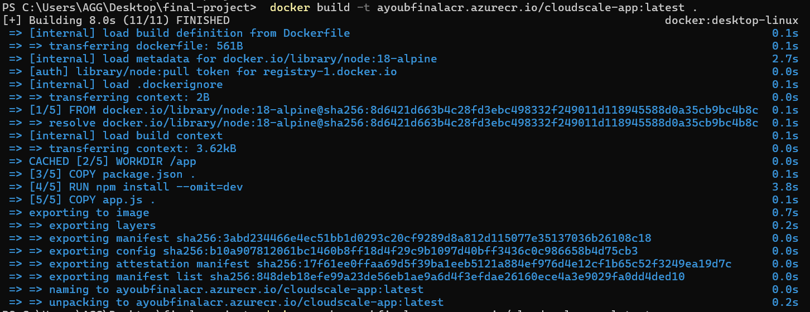
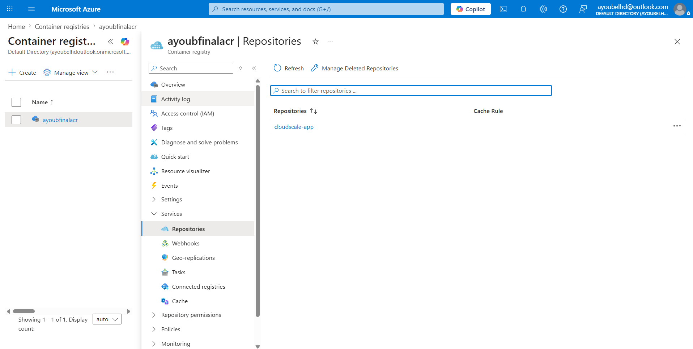
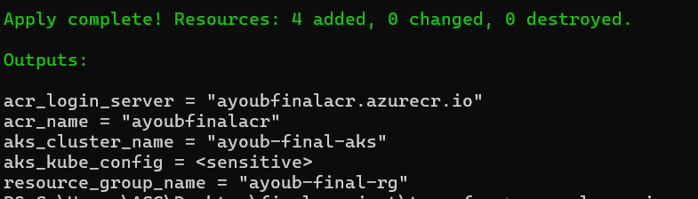
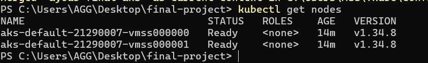
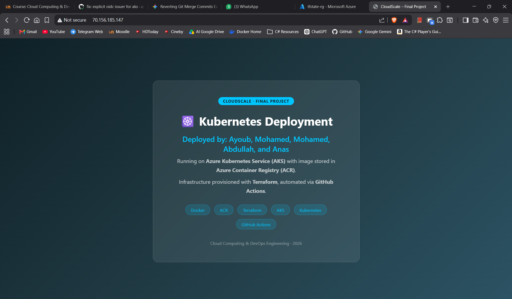
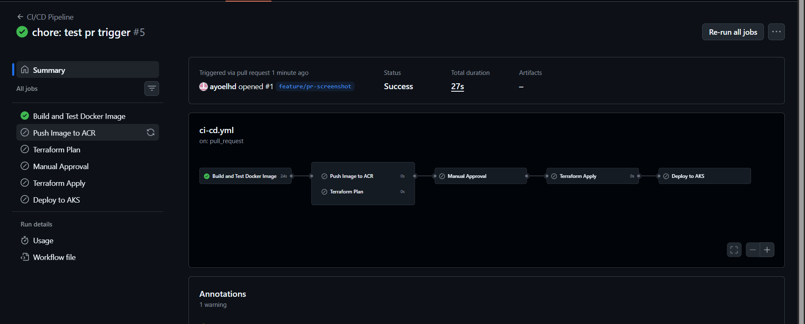
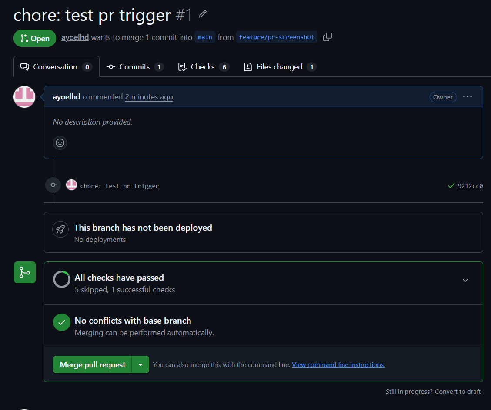
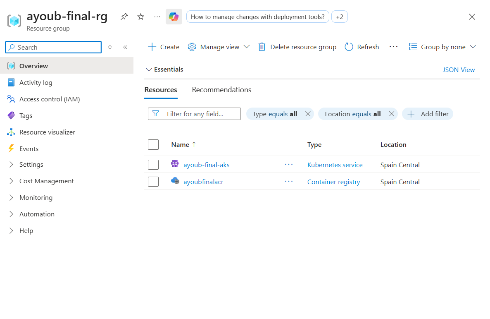

# Final Project – CI/CD Pipeline with AKS & ACR

## Authors

| Name | Student ID |
|------|-----------|
| [Your Name] | [Your ID] |
| [Teammate 2] | [ID] |
| [Teammate 3] | [ID] |
| [Teammate 4] | [ID] |
| [Teammate 5] | [ID] |
| [Teammate 6] | [ID] |

---

## Project Title & Description

**CloudScale Kubernetes Deployment**

A fully automated CI/CD pipeline that:
- Builds and tests a Dockerized Node.js web application
- Stores the image in Azure Container Registry (ACR)
- Provisions AKS + ACR infrastructure with Terraform
- Deploys the app to Azure Kubernetes Service (AKS) with 3 replicas
- Automates everything via GitHub Actions with a manual approval gate

---

## Architecture Diagram

```
┌─────────────────────────────────────────────────────────────────────┐
│                        GitHub Repository                            │
│                                                                     │
│  Developer Push / PR                                                │
│         │                                                           │
│         ▼                                                           │
│  ┌─────────────────────────────────────────────────────────────┐   │
│  │              GitHub Actions CI/CD Pipeline                  │   │
│  │                                                             │   │
│  │  1. Build & Test ──► 2. Push to ACR ──► 3. Terraform Plan  │   │
│  │                                               │             │   │
│  │                              4. Manual Approval Gate        │   │
│  │                                               │             │   │
│  │                         5. Terraform Apply ◄──┘             │   │
│  │                                               │             │   │
│  │                              6. Deploy to AKS               │   │
│  └───────────────────────────────────────────────┬─────────────┘   │
└──────────────────────────────────────────────────|─────────────────┘
                                                   │
                              ┌────────────────────▼────────────────┐
                              │            Azure Cloud               │
                              │                                      │
                              │  ┌──────────────────────────────┐   │
                              │  │  Resource Group               │   │
                              │  │  yourname-final-rg           │   │
                              │  │                               │   │
                              │  │  ┌────────────────────────┐  │   │
                              │  │  │ ACR                    │  │   │
                              │  │  │ yournamefinalacr       │  │   │
                              │  │  │ cloudscale-app:latest  │  │   │
                              │  │  └────────────┬───────────┘  │   │
                              │  │               │ image pull    │   │
                              │  │  ┌────────────▼───────────┐  │   │
                              │  │  │ AKS Cluster            │  │   │
                              │  │  │ 2 nodes (Standard_B2s) │  │   │
                              │  │  │                        │  │   │
                              │  │  │  Pod 1 │ Pod 2 │ Pod 3 │  │   │
                              │  │  │  (3 replicas)          │  │   │
                              │  │  │         │              │  │   │
                              │  │  │  LoadBalancer Service  │  │   │
                              │  │  │  Public IP → Port 80   │  │   │
                              │  │  └────────────────────────┘  │   │
                              │  └──────────────────────────────┘   │
                              └──────────────────────────────────────┘
```

---

## Setup Instructions

### Prerequisites
- Docker Desktop
- Terraform >= 1.5
- Azure CLI
- kubectl

### 1. Docker – Build & Test Locally

```bash
# Build
docker build -t cloudscale-app:latest .

# Test locally
docker run -p 3000:3000 cloudscale-app:latest
# open http://localhost:3000
# test health: http://localhost:3000/health
```

### 2. Terraform – Provision Infrastructure

```bash
cd terraform

# Update variables.tf with your student_name
terraform init
terraform plan
terraform apply
```

After apply, note the outputs:
- `acr_login_server` → add as GitHub Secret `ACR_LOGIN_SERVER`
- `aks_cluster_name` → add as GitHub Secret `AKS_CLUSTER_NAME`
- `resource_group_name` → add as GitHub Secret `RESOURCE_GROUP_NAME`

### 3. Kubernetes – Connect kubectl

```bash
az aks get-credentials --resource-group yourname-final-rg --name yourname-final-aks
kubectl get nodes   # should show 2 nodes
```

### 4. Push image to ACR manually (first time)

```bash
az acr login --name yournamefinalacr
docker build -t yournamefinalacr.azurecr.io/cloudscale-app:latest .
docker push yournamefinalacr.azurecr.io/cloudscale-app:latest
```

---

## GitHub Actions Workflow Explanation

| Job | Trigger | What it does |
|-----|---------|-------------|
| `build-and-test` | Every push & PR | Builds Docker image, runs health check test |
| `push-to-acr` | Push to main | Logs into ACR, pushes image with commit SHA tag |
| `terraform-plan` | Push to main | Runs init, plan, saves plan artifact |
| `manual-approval` | After plan | Pauses for human approval via production environment |
| `terraform-apply` | After approval | Applies saved Terraform plan |
| `deploy-to-aks` | After apply | Updates manifest with new image, applies to AKS cluster |

### GitHub Secrets Required

| Secret | Description |
|--------|-------------|
| `ARM_CLIENT_ID` | Service Principal client ID |
| `ARM_CLIENT_SECRET` | Service Principal secret |
| `ARM_SUBSCRIPTION_ID` | Azure subscription ID |
| `ARM_TENANT_ID` | Azure tenant ID |
| `AZURE_CREDENTIALS` | Full SP JSON (for azure/login action) |
| `ACR_LOGIN_SERVER` | e.g. yournamefinalacr.azurecr.io |
| `ACR_NAME` | e.g. yournamefinalacr |
| `AKS_CLUSTER_NAME` | e.g. yourname-final-aks |
| `RESOURCE_GROUP_NAME` | e.g. yourname-final-rg |

---

## Screenshots

### 1. Docker build successful


### 2. Image in ACR


### 3. terraform apply successful


### 4. AKS nodes ready


### 5. Application running in browser


### 6. GitHub Actions workflow successful


### 7. GitHub Actions approval gate


### 8. Azure Portal showing AKS + ACR


---

## Step-by-Step Solution

1. Write `app.js` with `/health` endpoint and `index.html` displaying your name
2. Write `Dockerfile` using `node:18-alpine`, expose port 3000
3. Write Terraform files to provision Resource Group, ACR, and AKS with managed identity
4. Grant AKS the `AcrPull` role so it can pull images without secrets
5. Write Kubernetes `deployment.yaml` with 3 replicas, readiness and liveness probes
6. Write Kubernetes `service.yaml` as LoadBalancer type to expose a public IP
7. Write GitHub Actions workflow with 6 jobs covering build, push, plan, approve, apply, deploy
8. Run `terraform apply` locally first to create infrastructure
9. Add all GitHub Secrets to the repo settings
10. Create `production` environment with required reviewer
11. Push code → trigger pipeline → approve → verify deployment

---

## Repository Link

https://github.com/YOURUSERNAME/final-project-cloudscale

---

## ⚠️ Cost Reminder

Run `terraform destroy` after taking all screenshots to avoid unnecessary charges (~$1.60/day).
